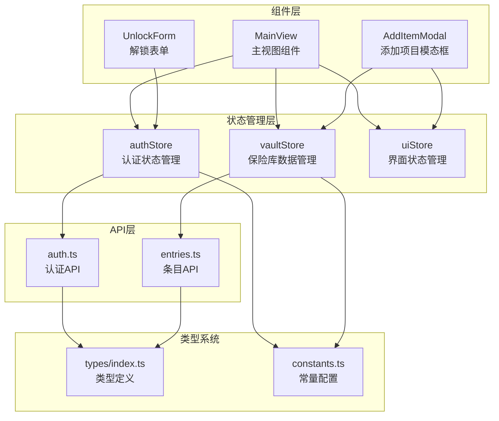
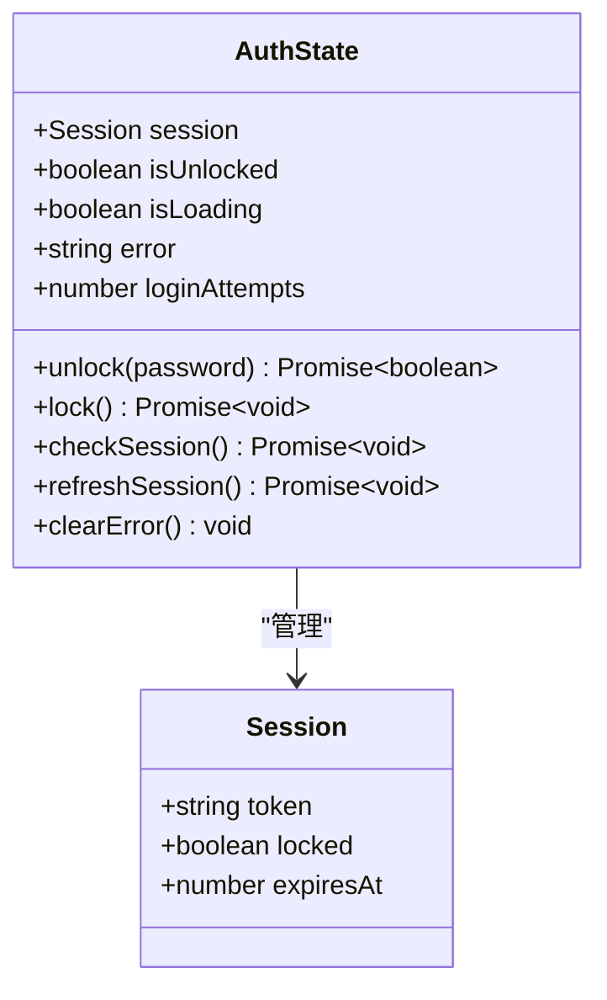
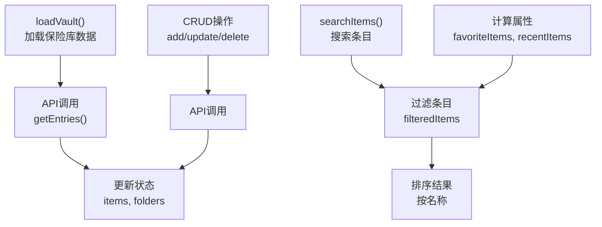
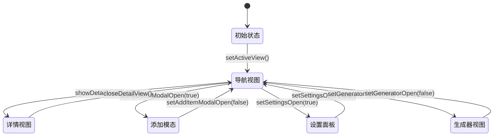
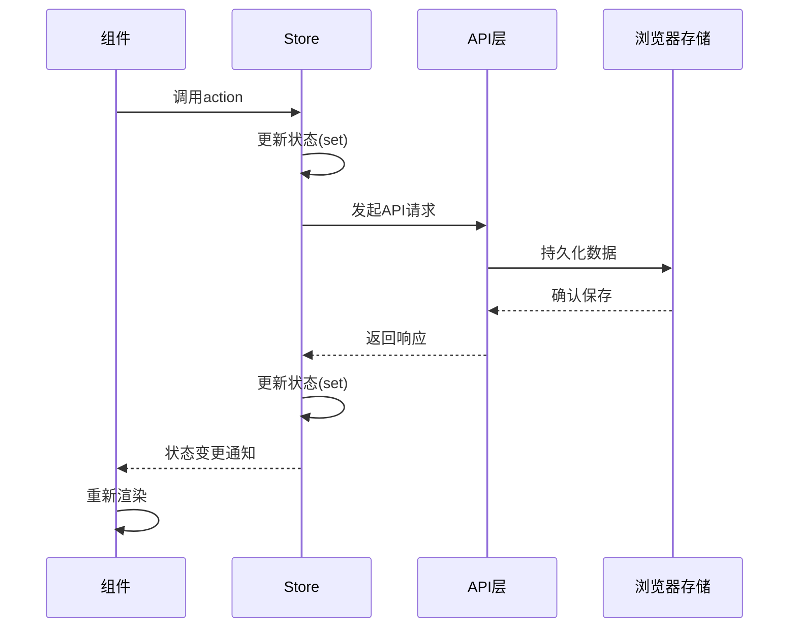
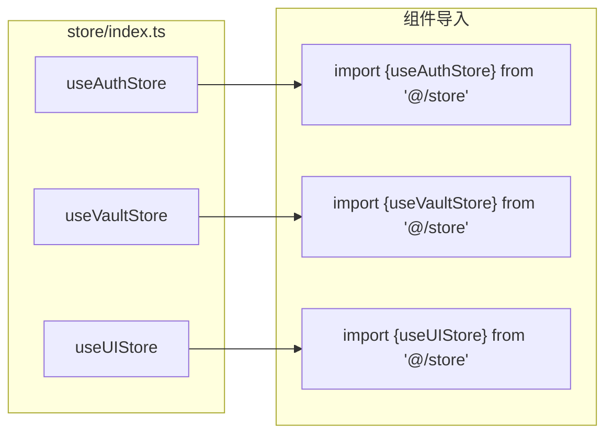
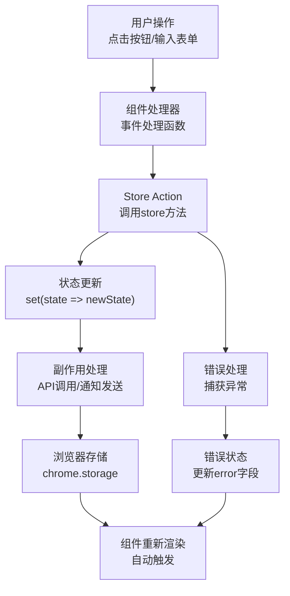
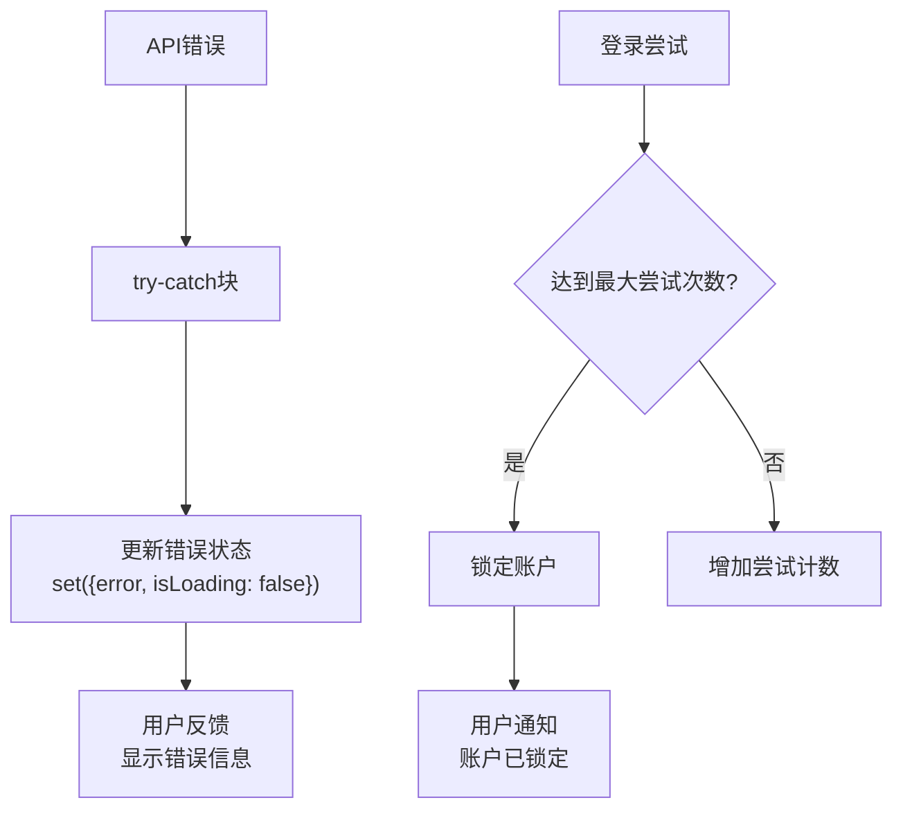

# 状态管理

<cite>
**本文档引用的文件**
- [authStore.ts](file://extension/store/authStore.ts)
- [vaultStore.ts](file://extension/store/vaultStore.ts)
- [uiStore.ts](file://extension/store/uiStore.ts)
- [index.ts](file://extension/store/index.ts)
- [MainView.tsx](file://extension/components/MainView.tsx)
- [UnlockForm.tsx](file://extension/components/UnlockForm.tsx)
- [AddItemModal.tsx](file://extension/components/AddItemModal.tsx)
- [constants.ts](file://extension/utils/constants.ts)
- [types.ts](file://extension/types/index.ts)
- [auth.ts](file://extension/lib/api/auth.ts)
- [entries.ts](file://extension/lib/api/entries.ts)
</cite>

## 目录
1. [简介](#简介)
2. [项目架构概览](#项目架构概览)
3. [核心Store组件](#核心store组件)
4. [状态管理模式](#状态管理模式)
5. [模块化组织方式](#模块化组织方式)
6. [状态变更流程](#状态变更流程)
7. [实际使用示例](#实际使用示例)
8. [性能优化策略](#性能优化策略)
9. [错误处理机制](#错误处理机制)
10. [总结](#总结)

## 简介

SecureFox采用Zustand作为其状态管理解决方案，实现了三个核心store：`authStore`（认证状态）、`vaultStore`（保险库数据）和`uiStore`（界面状态）。这种设计模式提供了集中化的状态管理，确保了应用状态的一致性和可预测性。

## 项目架构概览

SecureFox的状态管理系统采用了模块化的架构设计，每个store负责特定的功能领域：



**图表来源**
- [authStore.ts](file://extension/store/authStore.ts#L1-L157)
- [vaultStore.ts](file://extension/store/vaultStore.ts#L1-L233)
- [uiStore.ts](file://extension/store/uiStore.ts#L1-L135)
- [index.ts](file://extension/store/index.ts#L1-L3)

## 核心Store组件

### 认证状态管理 (authStore)

`authStore`负责管理用户的认证状态，包括解锁/锁定操作、会话管理和错误处理。

#### 核心状态结构



**图表来源**
- [authStore.ts](file://extension/store/authStore.ts#L6-L20)
- [types.ts](file://extension/types/index.ts#L139-L143)

#### 主要功能特性

1. **解锁机制**：支持密码验证和会话创建
2. **锁定机制**：安全地清理会话数据
3. **会话刷新**：自动延长会话有效期
4. **错误处理**：登录尝试限制和错误提示
5. **自动刷新**：每分钟检查会话状态

**章节来源**
- [authStore.ts](file://extension/store/authStore.ts#L31-L142)

### 保险库数据管理 (vaultStore)

`vaultStore`管理密码库的所有数据，包括条目列表、文件夹结构、搜索功能和CRUD操作。

#### 数据流架构



**图表来源**
- [vaultStore.ts](file://extension/store/vaultStore.ts#L86-L230)

#### 计算属性系统

vaultStore实现了智能的计算属性，提供高效的派生状态：

- **filteredItems**：基于搜索查询和文件夹筛选的结果
- **favoriteItems**：收藏的条目集合
- **recentItems**：最近修改的10个条目

**章节来源**
- [vaultStore.ts](file://extension/store/vaultStore.ts#L46-L84)

### 界面状态管理 (uiStore)

`uiStore`控制用户界面的各种状态，包括模态框、通知系统和导航状态。

#### 界面状态层次



**图表来源**
- [uiStore.ts](file://extension/store/uiStore.ts#L8-L18)

**章节来源**
- [uiStore.ts](file://extension/store/uiStore.ts#L32-L128)

## 状态管理模式

### Zustand核心概念

SecureFox使用Zustand的函数式状态管理模式：



**图表来源**
- [authStore.ts](file://extension/store/authStore.ts#L31-L70)
- [vaultStore.ts](file://extension/store/vaultStore.ts#L86-L104)

### 状态订阅机制

每个store都支持React组件的自动订阅，当状态发生变化时，相关组件会自动重新渲染。

**章节来源**
- [authStore.ts](file://extension/store/authStore.ts#L22-L157)
- [vaultStore.ts](file://extension/store/vaultStore.ts#L36-L233)
- [uiStore.ts](file://extension/store/uiStore.ts#L32-L135)

## 模块化组织方式

### Store导出结构



**图表来源**
- [index.ts](file://extension/store/index.ts#L1-L3)

### 组件间状态共享

不同组件通过各自的store hook访问共享状态：

- **MainView**：同时使用`useAuthStore`和`useVaultStore`
- **UnlockForm**：仅使用`useAuthStore`
- **AddItemModal**：使用`useVaultStore`和`useUIStore`

**章节来源**
- [MainView.tsx](file://extension/components/MainView.tsx#L4-L28)
- [UnlockForm.tsx](file://extension/components/UnlockForm.tsx#L8-L10)
- [AddItemModal.tsx](file://extension/components/AddItemModal.tsx#L12-L14)

## 状态变更流程

### 用户操作到状态更新的完整链条



**图表来源**
- [authStore.ts](file://extension/store/authStore.ts#L31-L70)
- [vaultStore.ts](file://extension/store/vaultStore.ts#L122-L148)

### 实际状态变更示例

#### 解锁流程

1. **用户输入密码**：UnlockForm收集密码输入
2. **调用unlock action**：authStore的unlock方法被调用
3. **API验证**：向服务器发送解锁请求
4. **状态更新**：成功时更新session和isUnlocked状态
5. **通知广播**：发送VAULT_UNLOCKED消息给其他扩展部分
6. **组件更新**：MainView等组件检测到状态变化并重新渲染

**章节来源**
- [authStore.ts](file://extension/store/authStore.ts#L31-L70)
- [UnlockForm.tsx](file://extension/components/UnlockForm.tsx#L19-L33)

#### 添加条目流程

1. **表单提交**：AddItemModal收集表单数据
2. **调用addItem action**：vaultStore的addItem方法被调用
3. **API创建**：向服务器发送创建请求
4. **状态同步**：更新本地items数组
5. **用户反馈**：显示成功/失败通知

**章节来源**
- [vaultStore.ts](file://extension/store/vaultStore.ts#L122-L148)
- [AddItemModal.tsx](file://extension/components/AddItemModal.tsx#L195-L301)

## 实际使用示例

### 在组件中使用Store

#### MainView中的状态使用

MainView展示了如何在单一组件中使用多个store：

```typescript
// 从store导入所需的状态和动作
const {lock} = useAuthStore();
const {
    loadVault,
    searchItems,
    selectFolder,
    searchQuery,
    folders,
    items,
    isLoading
} = useVaultStore();
const {activeView, setActiveView, setAddItemModalOpen, detailViewType, closeDetailView} = useUIStore();
```

#### UnlockForm中的认证状态

UnlockForm专注于认证相关的状态管理：

```typescript
const {unlock, isLoading, error, loginAttempts, clearError} = useAuthStore();
```

#### AddItemModal中的数据操作

AddItemModal结合了vault和ui状态：

```typescript
const {isAddItemModalOpen, setAddItemModalOpen, showNotification} = useUIStore();
const {addItem} = useVaultStore();
```

**章节来源**
- [MainView.tsx](file://extension/components/MainView.tsx#L17-L28)
- [UnlockForm.tsx](file://extension/components/UnlockForm.tsx#L8-L10)
- [AddItemModal.tsx](file://extension/components/AddItemModal.tsx#L12-L14)

### 状态持久化机制

SecureFox使用Chrome的session存储来持久化关键状态：

```typescript
// 会话存储示例
await chrome.storage.session.set({
    [STORAGE_KEYS.SESSION]: session,
});
```

**章节来源**
- [auth.ts](file://extension/lib/api/auth.ts#L25-L29)
- [authStore.ts](file://extension/store/authStore.ts#L38-L39)

## 性能优化策略

### 计算属性优化

vaultStore使用计算属性来避免重复计算：

```typescript
// 计算属性：只在依赖变化时重新计算
get filteredItems() {
    const state = get();
    // 过滤和排序逻辑
    return filtered.sort((a, b) => a.name.localeCompare(b.name));
}
```

### 状态订阅优化

- **细粒度订阅**：组件只订阅需要的状态
- **状态分离**：不同store管理不同领域的状态
- **批量更新**：Zustand的批量更新机制减少不必要的重渲染

### 内存管理

- **自动清理**：会话过期时自动清理存储
- **错误恢复**：状态错误时的回滚机制

**章节来源**
- [vaultStore.ts](file://extension/store/vaultStore.ts#L46-L84)
- [authStore.ts](file://extension/store/authStore.ts#L145-L156)

## 错误处理机制

### 分层错误处理



**图表来源**
- [authStore.ts](file://extension/store/authStore.ts#L56-L70)
- [vaultStore.ts](file://extension/store/vaultStore.ts#L143-L148)

### 具体错误处理策略

1. **认证错误**：登录尝试限制和错误累积
2. **网络错误**：API调用失败的优雅降级
3. **存储错误**：浏览器存储访问失败的处理
4. **状态恢复**：错误状态下的状态回滚

**章节来源**
- [authStore.ts](file://extension/store/authStore.ts#L56-L70)
- [vaultStore.ts](file://extension/store/vaultStore.ts#L98-L103)

## 总结

SecureFox的状态管理系统展现了现代前端应用的最佳实践：

### 核心优势

1. **模块化设计**：三个独立的store各司其职，职责清晰
2. **类型安全**：完整的TypeScript类型定义确保类型安全
3. **性能优化**：计算属性和细粒度订阅提升性能
4. **错误处理**：完善的错误处理和恢复机制
5. **用户体验**：流畅的状态变更和即时反馈

### 技术特点

- **Zustand集成**：轻量级状态管理，无样板代码
- **异步操作**：Promise-based的异步状态更新
- **跨组件通信**：通过store实现组件间的状态共享
- **持久化存储**：浏览器存储与应用状态的同步

### 扩展性考虑

该状态管理架构具有良好的扩展性：
- 新功能可以轻松添加到现有store中
- 可以根据需要添加新的store
- 现有的通信机制支持复杂的跨组件交互

这种设计模式为SecureFox提供了稳定、高效且易于维护的状态管理解决方案，确保了应用的可靠性和用户体验。