# 自动填充机制

<cite>
**本文档中引用的文件**
- [content.ts](file://extension/entrypoints/content.ts)
- [background.ts](file://extension/entrypoints/background.ts)
- [CredentialMenu.ts](file://extension/entrypoints/content/CredentialMenu.ts)
- [InlineAutofillIcon.ts](file://extension/entrypoints/content/InlineAutofillIcon.ts)
- [constants.ts](file://extension/utils/constants.ts)
- [entries.ts](file://extension/lib/api/entries.ts)
- [helpers.ts](file://extension/utils/helpers.ts)
- [index.ts](file://extension/types/index.ts)
</cite>

## 目录
1. [简介](#简介)
2. [系统架构概览](#系统架构概览)
3. [内容脚本核心机制](#内容脚本核心机制)
4. [凭据菜单组件](#凭据菜单组件)
5. [内联自动填充图标](#内联自动填充图标)
6. [后台服务管理](#后台服务管理)
7. [消息传递流程](#消息传递流程)
8. [安全限制与应对措施](#安全限制与应对措施)
9. [性能优化策略](#性能优化策略)
10. [故障排除指南](#故障排除指南)

## 简介

SecureFox的自动填充功能是一个高度集成的系统，能够在网页登录表单中智能检测并提供密码填充服务。该系统通过三个主要组件协同工作：内容脚本负责页面检测和用户交互，凭据菜单提供直观的选择界面，内联图标实现便捷的触发机制，而后台服务则管理整个系统的生命周期和数据同步。

## 系统架构概览

自动填充系统采用分层架构设计，确保了良好的模块化和可维护性：

```mermaid
graph TB
subgraph "浏览器环境"
CS[内容脚本<br/>content.ts]
CM[CredentialMenu<br/>凭据菜单]
IA[InlineAutofillIcon<br/>内联图标]
end
subgraph "扩展后台"
BG[background.ts<br/>后台服务]
API[API接口<br/>entries.ts]
end
subgraph "后端服务"
SERVER[SecureFox服务器]
DB[(数据库)]
end
subgraph "用户界面"
POPUP[弹出窗口]
ICON[扩展图标]
end
CS --> CM
CS --> IA
CS < --> BG
BG < --> API
API < --> SERVER
SERVER --> DB
BG --> POPUP
BG --> ICON
style CS fill:#e1f5fe
style BG fill:#f3e5f5
style API fill:#e8f5e8
style SERVER fill:#fff3e0
```

**图表来源**
- [content.ts](file://extension/entrypoints/content.ts#L1-L50)
- [background.ts](file://extension/entrypoints/background.ts#L1-L50)
- [CredentialMenu.ts](file://extension/entrypoints/content/CredentialMenu.ts#L1-L50)
- [InlineAutofillIcon.ts](file://extension/entrypoints/content/InlineAutofillIcon.ts#L1-L50)

## 内容脚本核心机制

### 页面注入与初始化

内容脚本作为自动填充系统的核心入口点，在页面加载时自动注入并开始监控：

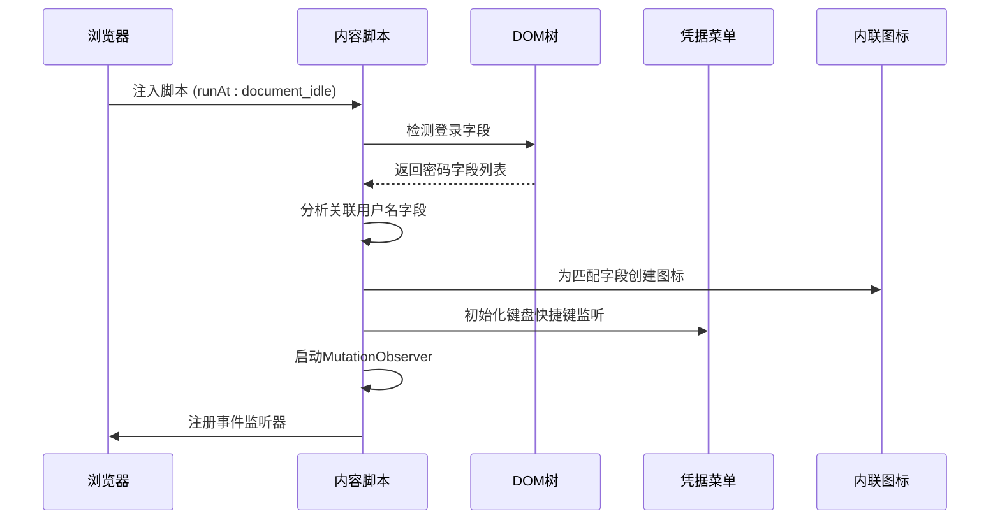

**图表来源**
- [content.ts](file://extension/entrypoints/content.ts#L684-L741)

### 登录字段检测算法

内容脚本使用智能算法识别登录表单中的用户名和密码字段：

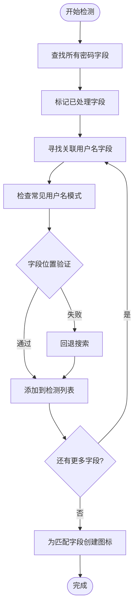

**图表来源**
- [content.ts](file://extension/entrypoints/content.ts#L17-L82)

### 内联图标系统

内联图标提供了直观的视觉提示和快速访问功能：

**章节来源**
- [InlineAutofillIcon.ts](file://extension/entrypoints/content/InlineAutofillIcon.ts#L1-L215)

内联图标组件具有以下特性：
- **智能定位**：根据输入框的CSS定位属性自动调整位置
- **渐变动画**：平滑的显示和隐藏动画效果
- **响应式设计**：适配不同尺寸的输入框
- **无障碍支持**：完整的ARIA标签和键盘导航

### 凭据菜单系统

凭据菜单提供了完整的凭据选择和管理界面：

**章节来源**
- [CredentialMenu.ts](file://extension/entrypoints/content/CredentialMenu.ts#L1-L432)

菜单系统的核心功能包括：
- **智能排序**：基于使用频率和时间的自动排序
- **搜索过滤**：实时搜索匹配的凭据条目
- **键盘导航**：完整的键盘操作支持
- **视觉反馈**：清晰的状态指示和操作确认

## 凭据菜单组件

### 菜单渲染架构

凭据菜单采用模块化设计，支持动态内容生成：

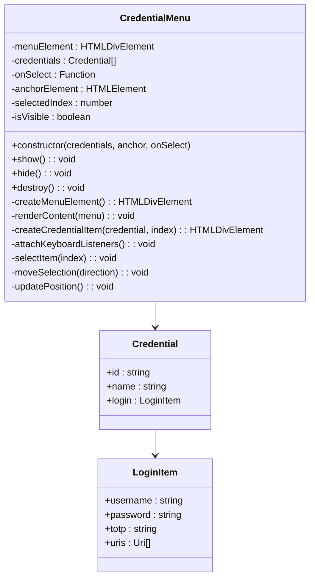

**图表来源**
- [CredentialMenu.ts](file://extension/entrypoints/content/CredentialMenu.ts#L6-L32)

### 键盘导航系统

菜单支持完整的键盘导航体验：

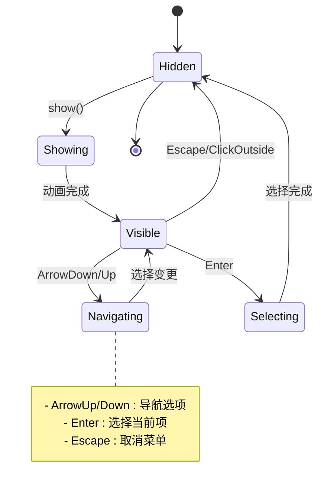

**图表来源**
- [CredentialMenu.ts](file://extension/entrypoints/content/CredentialMenu.ts#L262-L285)

## 内联自动填充图标

### 图标定位算法

内联图标使用复杂的定位算法确保在各种布局下都能正确显示：

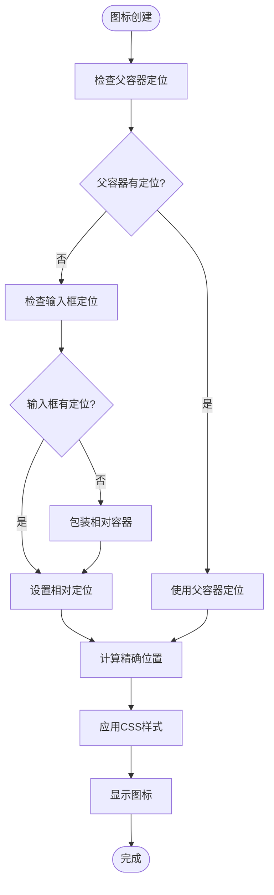

**图表来源**
- [InlineAutofillIcon.ts](file://extension/entrypoints/content/InlineAutofillIcon.ts#L105-L148)

### 动画系统

图标采用CSS过渡动画实现流畅的用户体验：

**章节来源**
- [InlineAutofillIcon.ts](file://extension/entrypoints/content/InlineAutofillIcon.ts#L150-L174)

动画特性包括：
- **透明度变化**：0.2秒的淡入淡出效果
- **指针事件控制**：动画期间禁用交互
- **响应式重绘**：使用requestAnimationFrame优化性能

## 后台服务管理

### 生命周期管理

后台服务负责整个扩展的生命周期管理：

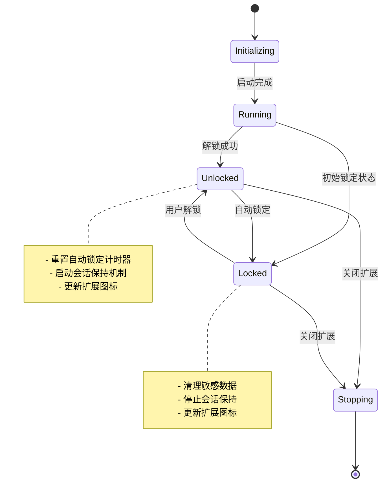

**图表来源**
- [background.ts](file://extension/entrypoints/background.ts#L1-L454)

### 自动锁定机制

后台服务实现了智能的自动锁定功能：

**章节来源**
- [background.ts](file://extension/entrypoints/background.ts#L56-L94)

自动锁定特性：
- **定时锁定**：支持15分钟、1小时、6小时等间隔
- **浏览器关闭锁定**：支持完全关闭浏览器时锁定
- **活动监控**：监听用户活动重置计时器
- **会话保持**：为"关闭时锁定"模式维护会话

### 数据同步管理

后台服务协调前端数据与后端存储的同步：

**章节来源**
- [background.ts](file://extension/entrypoints/background.ts#L115-L152)

同步功能包括：
- **凭据检索**：从后端获取匹配的凭据条目
- **状态查询**：检查密码库的解锁状态
- **批量操作**：支持多个并发请求的处理
- **错误恢复**：优雅处理网络异常和认证失效

## 消息传递流程

### 完整交互路径

自动填充系统的消息传递遵循严格的协议：

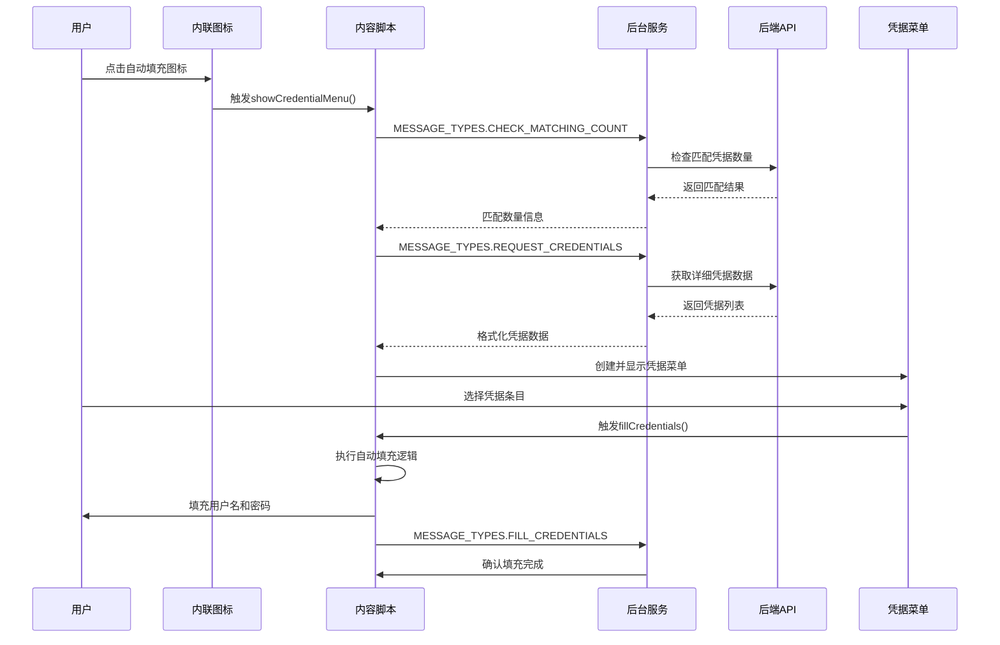

**图表来源**
- [content.ts](file://extension/entrypoints/content.ts#L120-L165)
- [background.ts](file://extension/entrypoints/background.ts#L154-L289)

### 消息类型定义

系统使用标准化的消息类型进行通信：

**章节来源**
- [constants.ts](file://extension/utils/constants.ts#L55-L72)

消息类型分类：
- **凭据相关**：REQUEST_CREDENTIALS、CHECK_MATCHING_COUNT、FILL_CREDENTIALS
- **状态管理**：GET_STATUS、VAULT_LOCKED、VAULT_UNLOCKED
- **操作控制**：UNLOCK_VAULT、LOCK_VAULT、SAVE_CREDENTIALS

### 跨域通信安全

系统实现了多层安全防护：

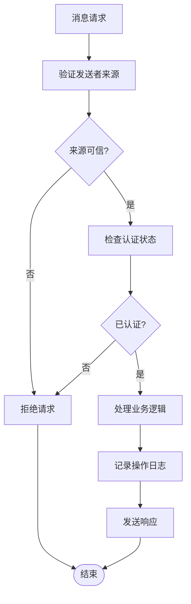

**图表来源**
- [background.ts](file://extension/entrypoints/background.ts#L154-L289)

## 安全限制与应对措施

### 同源策略处理

自动填充系统需要处理现代浏览器的安全限制：

**章节来源**
- [content.ts](file://extension/entrypoints/content.ts#L85-L118)

应对策略：
- **跨域检测**：智能识别同源和跨域页面
- **降级处理**：在受限环境中提供基础功能
- **权限检查**：验证扩展权限的有效性
- **安全通信**：使用chrome.runtime进行安全的消息传递

### 数据保护机制

系统实施多层次的数据保护：

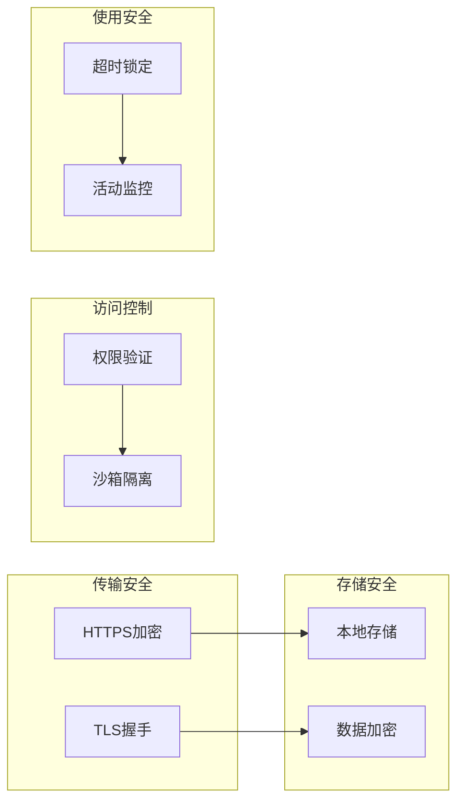

**图表来源**
- [background.ts](file://extension/entrypoints/background.ts#L16-L55)

### 隐私保护措施

自动填充系统严格遵守隐私保护原则：

**章节来源**
- [helpers.ts](file://extension/utils/helpers.ts#L112-L136)

隐私保护功能：
- **本地处理**：敏感数据在本地处理，不上传到云端
- **临时存储**：凭据信息仅在内存中临时存储
- **自动清理**：使用后立即清理敏感数据
- **用户控制**：完全由用户控制数据的存储和使用

## 性能优化策略

### 延迟加载机制

系统采用多种延迟加载技术提升性能：

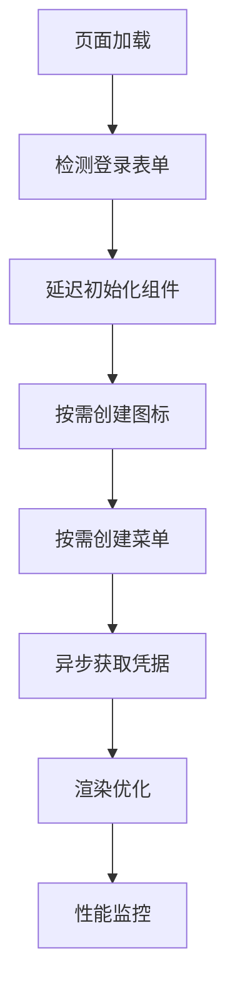

**图表来源**
- [content.ts](file://extension/entrypoints/content.ts#L684-L741)

### 内存管理

系统实现了智能的内存管理策略：

**章节来源**
- [content.ts](file://extension/entrypoints/content.ts#L712-L738)

内存优化技术：
- **弱引用映射**：使用WeakMap管理图标与字段的关联
- **事件清理**：及时移除不再需要的事件监听器
- **DOM优化**：最小化DOM操作和重排
- **垃圾回收**：主动清理不再使用的对象引用

### 缓存策略

系统采用多级缓存提升响应速度：

缓存层级：
1. **内存缓存**：最近使用的凭据信息
2. **DOM缓存**：已创建的UI组件实例
3. **会话缓存**：当前会话的配置和状态
4. **持久缓存**：用户偏好设置和历史记录

## 故障排除指南

### 常见问题诊断

自动填充系统的问题诊断流程：

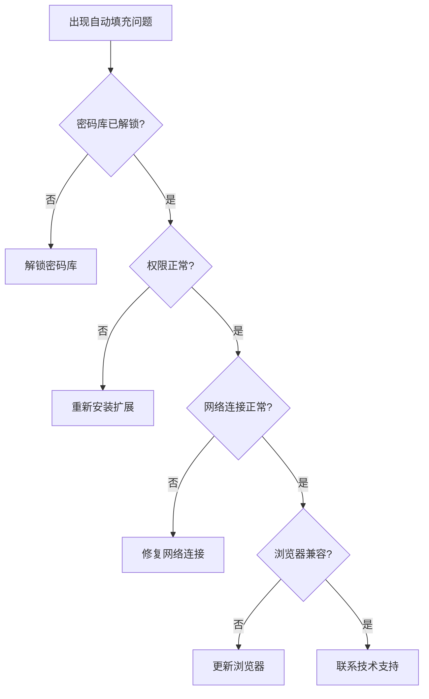

### 调试工具

系统提供了内置的调试功能：

**章节来源**
- [content.ts](file://extension/entrypoints/content.ts#L262-L324)

调试特性：
- **控制台日志**：详细的执行日志输出
- **状态通知**：实时的状态变化提醒
- **错误报告**：结构化的错误信息收集
- **性能指标**：关键操作的性能统计

### 兼容性处理

系统针对不同浏览器和版本提供兼容性支持：

兼容性矩阵：
- **Chrome**: 完全支持，包括MV3迁移
- **Firefox**: 完全支持，标准WebExtensions API
- **Edge**: 完全支持，基于Chromium内核
- **Safari**: 基础支持，部分高级功能受限

**章节来源**
- [background.ts](file://extension/entrypoints/background.ts#L394-L442)

## 结论

SecureFox的自动填充功能代表了现代浏览器扩展的最佳实践，通过精心设计的架构和完善的用户体验，为用户提供了安全、高效、易用的密码管理解决方案。系统的模块化设计确保了良好的可维护性和扩展性，而严格的安全措施则保障了用户数据的隐私和安全。

随着浏览器技术的发展和安全要求的提高，自动填充系统将继续演进，为用户提供更加智能和便捷的服务体验。