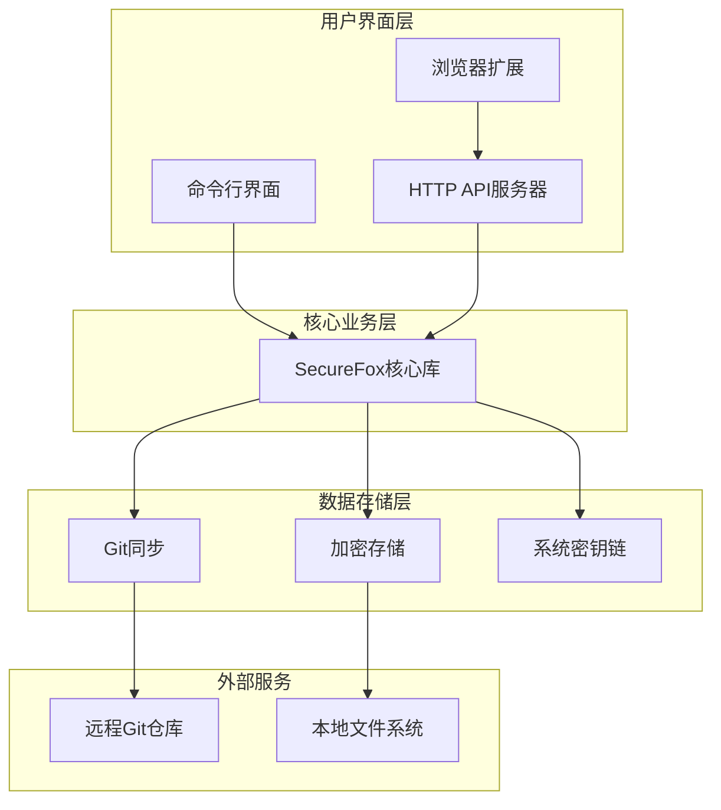
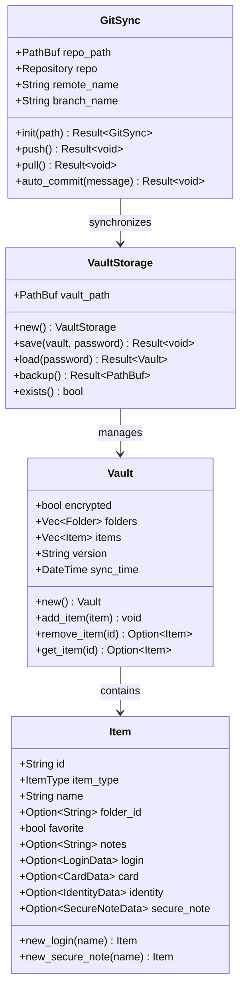
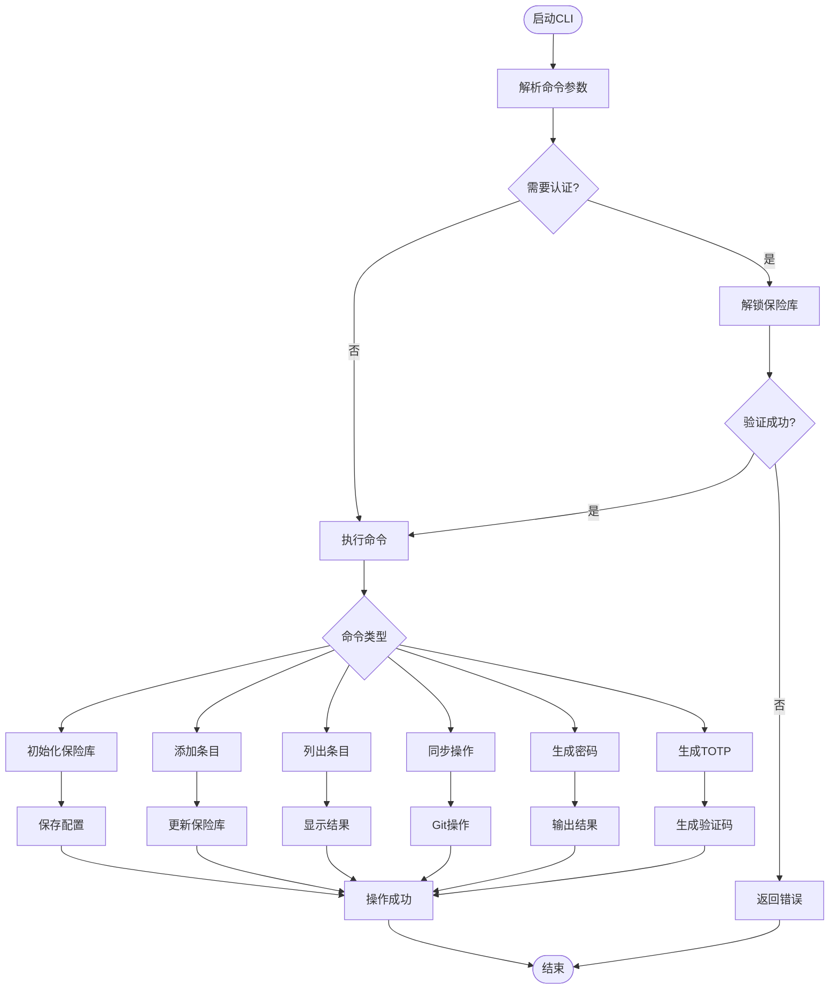
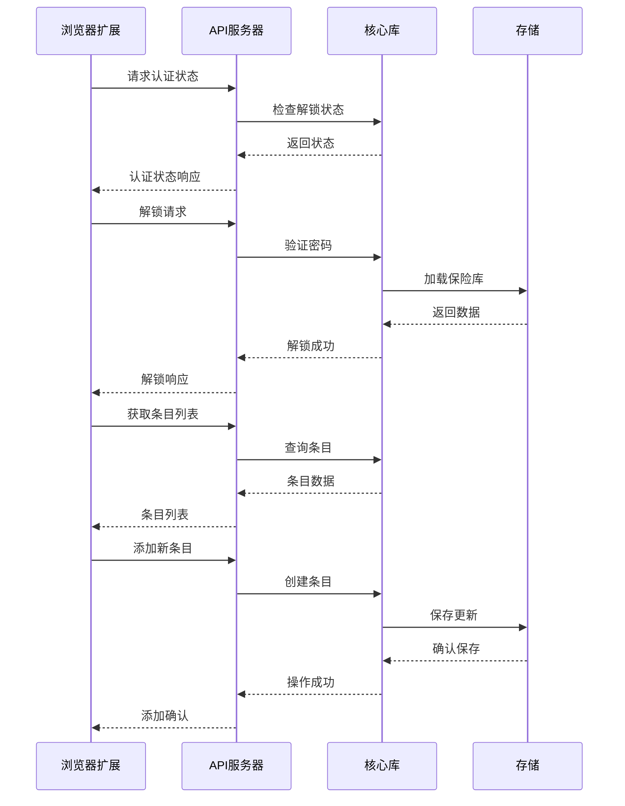
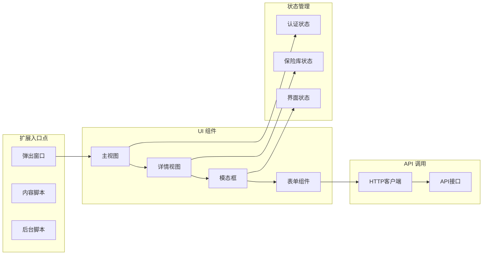
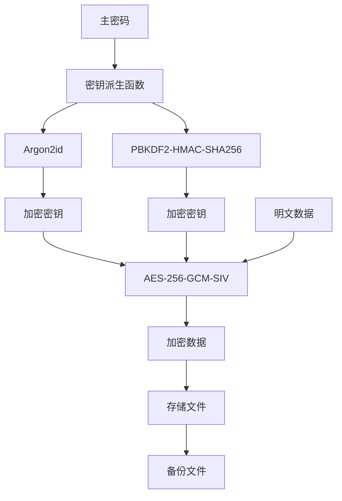
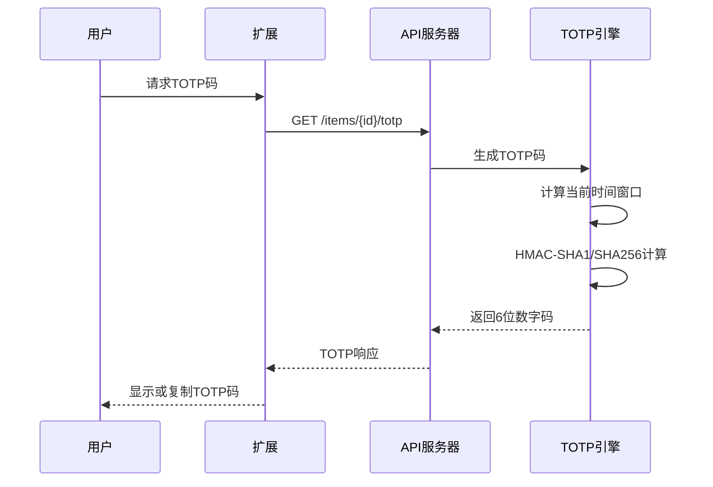
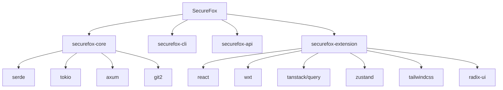

# SecureFox 系统概述

<cite>
**本文档中引用的文件**
- [README.md](file://README.md)
- [Cargo.toml](file://Cargo.toml)
- [core/src/lib.rs](file://core/src/lib.rs)
- [core/src/models.rs](file://core/src/models.rs)
- [core/src/crypto.rs](file://core/src/crypto.rs)
- [core/src/git_sync.rs](file://core/src/git_sync.rs)
- [core/src/storage.rs](file://core/src/storage.rs)
- [core/src/totp.rs](file://core/src/totp.rs)
- [cli/src/main.rs](file://cli/src/main.rs)
- [cli/src/commands/init.rs](file://cli/src/commands/init.rs)
- [cli/src/commands/add.rs](file://cli/src/commands/add.rs)
- [api/src/lib.rs](file://api/src/lib.rs)
- [extension/wxt.config.ts](file://extension/wxt.config.ts)
- [extension/package.json](file://extension/package.json)
</cite>

## 目录
1. [项目简介](#项目简介)
2. [核心价值与设计理念](#核心价值与设计理念)
3. [系统架构概览](#系统架构概览)
4. [核心组件详解](#核心组件详解)
5. [数据模型与安全机制](#数据模型与安全机制)
6. [功能特性](#功能特性)
7. [使用场景与最佳实践](#使用场景与最佳实践)
8. [技术栈与依赖](#技术栈与依赖)
9. [总结](#总结)

## 项目简介

SecureFox 是一个现代化的本地优先密码管理器，采用零知识加密架构，确保用户数据的安全性和隐私性。该项目以 Rust 语言开发，结合了强大的加密算法、Git 同步机制和现代化的浏览器扩展，为用户提供了一个安全、便捷且跨平台的密码管理解决方案。

### 主要特点

- **零知识加密**：主密码永远不会离开用户的设备
- **本地优先设计**：所有数据都存储在本地设备上
- **端到端加密同步**：可选的 Git 基础同步功能
- **多平台支持**：支持 macOS、Linux 和 Windows
- **现代化界面**：基于 React 和 TypeScript 的浏览器扩展

## 核心价值与设计理念

### 零知识加密原则

SecureFox 坚持零知识加密的设计理念，这意味着：
- **主密码保护**：用户的主密码永远不会被发送到任何服务器
- **本地处理**：所有加密和解密操作都在本地设备上完成
- **数据隔离**：即使服务提供商也无法访问用户的数据内容

### 本地优先架构

- **数据主权**：用户完全控制自己的密码数据
- **离线可用**：无需网络连接即可访问密码信息
- **隐私保护**：避免云端存储带来的隐私风险

### 开放透明

- **开源代码**：完整的源代码公开可审查
- **标准兼容**：支持 Bitwarden 导入格式
- **社区驱动**：欢迎社区贡献和反馈

## 系统架构概览

SecureFox 采用模块化的分层架构设计，主要包含以下核心组件：



**图表来源**
- [core/src/lib.rs](file://core/src/lib.rs#L1-L37)
- [cli/src/main.rs](file://cli/src/main.rs#L1-L50)
- [api/src/lib.rs](file://api/src/lib.rs#L1-L30)

### 架构层次说明

1. **表现层**：提供多种用户交互方式
2. **业务逻辑层**：核心密码管理功能
3. **数据访问层**：安全的数据存储和同步
4. **基础设施层**：底层系统服务

**章节来源**
- [README.md](file://README.md#L227-L271)
- [Cargo.toml](file://Cargo.toml#L1-L23)

## 核心组件详解

### SecureFox 核心库 (core)

核心库是整个系统的基础，提供了密码管理的核心功能：



**图表来源**
- [core/src/models.rs](file://core/src/models.rs#L8-L416)
- [core/src/storage.rs](file://core/src/storage.rs#L29-L100)
- [core/src/git_sync.rs](file://core/src/git_sync.rs#L13-L50)

#### 核心功能模块

1. **加密模块 (crypto)**：实现 AES-256-GCM-SIV 加密和 Argon2id/PBKDF2 密钥派生
2. **存储模块 (storage)**：管理加密的密码数据存储
3. **Git 同步模块 (git_sync)**：提供端到端加密的 Git 同步功能
4. **TOTP 模块 (totp)**：实现基于时间的一次性密码生成
5. **导入器模块 (importers)**：支持从其他密码管理器导入数据

**章节来源**
- [core/src/lib.rs](file://core/src/lib.rs#L1-L37)
- [core/src/crypto.rs](file://core/src/crypto.rs#L1-L50)
- [core/src/git_sync.rs](file://core/src/git_sync.rs#L1-L50)

### 命令行界面 (CLI)

CLI 提供了完整的密码管理功能，适合高级用户和自动化脚本：



**图表来源**
- [cli/src/main.rs](file://cli/src/main.rs#L330-L450)
- [cli/src/commands/init.rs](file://cli/src/commands/init.rs#L7-L89)

**章节来源**
- [cli/src/main.rs](file://cli/src/main.rs#L1-L451)
- [cli/src/commands/init.rs](file://cli/src/commands/init.rs#L1-L89)

### HTTP API 服务器

API 服务器为浏览器扩展提供后端支持：



**图表来源**
- [api/src/lib.rs](file://api/src/lib.rs#L25-L93)

**章节来源**
- [api/src/lib.rs](file://api/src/lib.rs#L1-L114)

### 浏览器扩展

浏览器扩展提供了直观的用户界面和自动填充功能：



**图表来源**
- [extension/wxt.config.ts](file://extension/wxt.config.ts#L1-L43)
- [extension/package.json](file://extension/package.json#L1-L47)

**章节来源**
- [extension/wxt.config.ts](file://extension/wxt.config.ts#L1-L43)
- [extension/package.json](file://extension/package.json#L1-L47)

## 数据模型与安全机制

### 核心数据模型

SecureFox 使用了与 Bitwarden 兼容的数据模型，支持多种类型的密码条目：

| 数据类型 | 描述 | 支持字段 |
|---------|------|----------|
| 登录条目 | 网站登录凭据 | 用户名、密码、TOTP、URL |
| 安全笔记 | 文本备注信息 | 笔记内容、自定义字段 |
| 卡片信息 | 信用卡和个人信息 | 卡号、有效期、持卡人 |
| 身份信息 | 个人身份资料 | 姓名、地址、电话号码 |

### 加密安全机制



**图表来源**
- [core/src/crypto.rs](file://core/src/crypto.rs#L129-L270)

#### 加密算法选择

- **密钥派生**：Argon2id 或 PBKDF2-HMAC-SHA256
- **对称加密**：AES-256-GCM-SIV（带认证）
- **随机数生成**：操作系统 CSPRNG

**章节来源**
- [core/src/models.rs](file://core/src/models.rs#L1-L416)
- [core/src/crypto.rs](file://core/src/crypto.rs#L1-L321)

### TOTP 双因素认证

SecureFox 内置了完整的 TOTP 实现，支持 RFC 6238 标准：



**图表来源**
- [core/src/totp.rs](file://core/src/totp.rs#L48-L75)

**章节来源**
- [core/src/totp.rs](file://core/src/totp.rs#L1-L210)

## 功能特性

### Git 同步功能

SecureFox 提供了强大的 Git 同步功能，支持端到端加密的数据同步：

#### 同步模式

1. **手动同步**：用户主动触发拉取和推送操作
2. **自动同步**：配置定时自动同步
3. **推送变更**：检测到本地更改时自动推送

#### 安全特性

- **端到端加密**：Git 仓库中的数据始终处于加密状态
- **SSH 密钥认证**：支持 SSH 密钥进行安全认证
- **冲突解决**：智能合并策略处理并发修改

### 浏览器自动填充

浏览器扩展提供了智能的自动填充功能：

- **智能匹配**：根据域名自动匹配登录凭据
- **快捷键支持**：支持键盘快捷键快速访问
- **安全复制**：敏感信息的安全复制机制

### 密码生成器

内置的密码生成器支持：

- **自定义长度**：支持 4-128 字符的密码长度
- **字符集选择**：可选数字、字母、符号组合
- **强度评估**：实时密码强度分析

**章节来源**
- [core/src/git_sync.rs](file://core/src/git_sync.rs#L1-L503)
- [cli/src/commands/add.rs](file://cli/src/commands/add.rs#L1-L109)

## 使用场景与最佳实践

### 典型使用场景

#### 场景一：个人密码管理
```bash
# 初始化保险库
securefox init --kdf argon2

# 添加 GitHub 登录
securefox add github.com --username user@example.com --generate --totp "otpauth://totp/GitHub:user?secret=JBSWY3DPEHPK3PXP"

# 查看条目
securefox list --search github

# 生成强密码
securefox generate --length 32 --symbols --numbers
```

#### 场景二：团队协作同步
```bash
# 初始化带有 Git 远程的保险库
securefox init --remote git@github.com:team/securefox-vault.git --kdf argon2

# 自动同步配置
securefox sync enable --mode auto --interval 300

# 手动同步
securefox sync pull
securefox sync push
```

#### 场景三：浏览器扩展使用
1. 安装浏览器扩展
2. 启动 API 服务器：`securefox serve`
3. 在浏览器中点击扩展图标
4. 选择要填充的登录凭据
5. 自动填写登录表单

### 最佳实践建议

#### 安全配置
1. **选择强主密码**：至少 12 个字符，包含大小写字母、数字和特殊符号
2. **启用 Argon2id**：对于高安全性需求，使用 Argon2id 密钥派生
3. **配置 SSH 密钥**：为 Git 同步设置 SSH 密钥认证
4. **定期备份**：定期创建保险库备份

#### 工作流程
1. **初始化阶段**：选择合适的 KDF 算法，设置安全的主密码
2. **日常使用**：使用浏览器扩展快速访问，定期生成强密码
3. **同步管理**：配置适当的同步策略，定期检查同步状态
4. **维护更新**：定期更新软件版本，保持安全补丁

**章节来源**
- [cli/src/commands/init.rs](file://cli/src/commands/init.rs#L1-L89)
- [cli/src/commands/add.rs](file://cli/src/commands/add.rs#L1-L109)

## 技术栈与依赖

### 后端技术栈 (Rust)

| 组件 | 版本 | 用途 |
|------|------|------|
| Rust | 1.70+ | 主要编程语言 |
| Tokio | 1.35+ | 异步运行时 |
| Axum | - | Web 框架 |
| Serde | 1.0+ | 序列化/反序列化 |
| AES-GCM-SIV | - | 对称加密 |
| Argon2 | - | 密钥派生 |
| Git2 | - | Git 操作 |

### 前端技术栈 (TypeScript/React)

| 组件 | 版本 | 用途 |
|------|------|------|
| React | 19 | UI 框架 |
| WXT | - | 浏览器扩展框架 |
| TanStack Query | 5.0+ | 数据获取 |
| Zustand | 4.4+ | 状态管理 |
| Tailwind CSS | 3.3+ | 样式框架 |
| Radix UI | - | 可访问性组件 |

### 关键依赖关系



**图表来源**
- [Cargo.toml](file://Cargo.toml#L12-L22)
- [extension/package.json](file://extension/package.json#L17-L32)

**章节来源**
- [Cargo.toml](file://Cargo.toml#L1-L23)
- [extension/package.json](file://extension/package.json#L1-L47)

## 总结

SecureFox 是一个设计精良的现代密码管理器，通过以下核心优势为用户提供了安全可靠的密码管理解决方案：

### 核心优势

1. **零知识加密架构**：确保用户数据的绝对隐私
2. **模块化设计**：清晰的组件分离，便于维护和扩展
3. **多平台支持**：CLI、API、浏览器扩展的完整覆盖
4. **Git 同步**：安全可靠的跨设备同步方案
5. **现代化界面**：基于 React 的用户友好界面

### 技术特色

- **行业标准加密**：AES-256-GCM-SIV + Argon2id/PBKDF2
- **开放源码**：完全透明的代码审查
- **跨平台兼容**：支持主流操作系统
- **标准化格式**：与 Bitwarden 兼容的数据格式

### 发展前景

SecureFox 代表了密码管理器的发展方向，将安全性、易用性和功能性完美结合。其本地优先的设计理念和零知识加密原则，为用户提供了前所未有的数据控制权和隐私保护。

通过持续的开发和完善，SecureFox 有望成为密码管理领域的标杆产品，为用户提供更加安全、便捷的密码管理体验。