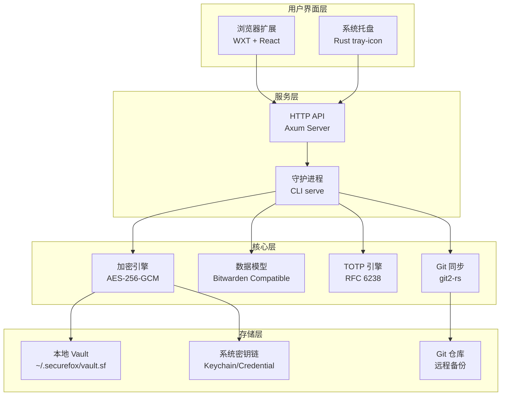
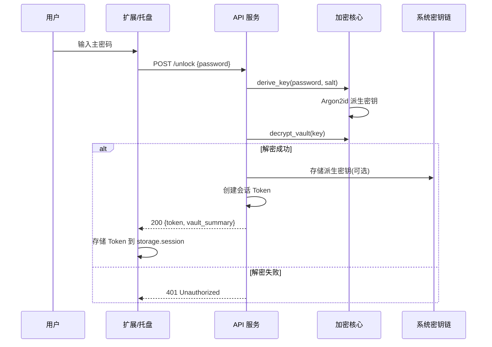
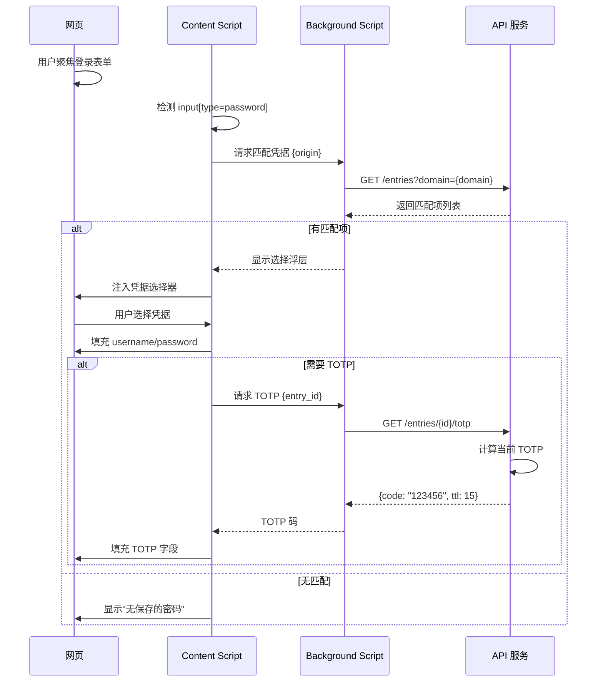
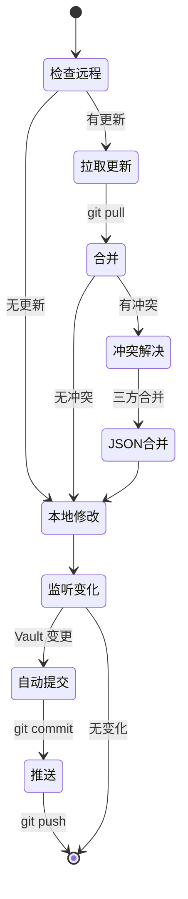
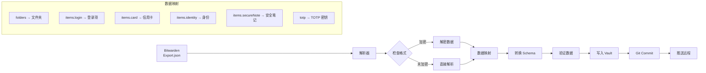

# SecureFox 技术方案

## 一、产品定位
SecureFox 是一款本地优先的密码管理器，采用零知识架构，通过 Git 实现跨设备同步，主要通过浏览器扩展提供用户界面。

## 二、系统架构



## 三、核心流程

### 3.1 解锁流程



### 3.2 自动填充流程



### 3.3 Git 同步流程



### 3.4 Bitwarden 导入流程



## 四、数据模型

### 4.1 Vault 结构（Bitwarden 兼容）

```typescript
interface Vault {
  encrypted: boolean
  folders: Folder[]
  items: Item[]
  version: string
  sync_time: number
}

interface Item {
  id: string
  type: ItemType // 1=Login, 2=SecureNote, 3=Card, 4=Identity
  name: string
  folderId?: string
  favorite: boolean
  notes?: string
  
  // Type-specific fields
  login?: {
    username?: string
    password?: string
    totp?: string  // otpauth://totp/... 格式
    uris?: Array<{
      uri: string
      match?: MatchType
    }>
  }
  
  card?: {
    cardholderName?: string
    number?: string
    expMonth?: string
    expYear?: string
    code?: string
  }
  
  identity?: {
    title?: string
    firstName?: string
    lastName?: string
    email?: string
    phone?: string
  }
  
  fields?: CustomField[]
  reprompt?: number
  creationDate: string
  revisionDate: string
}

interface CustomField {
  name: string
  value: string
  type: FieldType // 0=Text, 1=Hidden, 2=Boolean
}
```

### 4.2 加密存储格式

```json
{
  "version": "1.0",
  "kdf": "argon2id",
  "kdf_params": {
    "memory": 65536,
    "iterations": 3,
    "parallelism": 4
  },
  "salt": "base64_encoded_salt",
  "nonce": "base64_encoded_nonce",
  "encrypted_data": "base64_encoded_ciphertext"
}
```

## 五、技术栈详细说明

### 5.1 Rust 核心库依赖

```toml
[dependencies]
# 加密
argon2 = "0.5"
aes-gcm-siv = "0.11"
rand = "0.8"
zeroize = "1.7"  # 内存安全清除

# TOTP
totp-rs = "5.0"
qrcode = "0.14"
base32 = "0.4"

# 数据处理
serde = { version = "1.0", features = ["derive"] }
serde_json = "1.0"
chrono = { version = "0.4", features = ["serde"] }

# Git
git2 = "0.18"

# 系统集成
keyring = "2.0"  # 跨平台密钥链
```

### 5.2 API 服务依赖

```toml
[dependencies]
axum = "0.7"
tower = "0.4"
tokio = { version = "1", features = ["full"] }
jsonwebtoken = "9.0"
axum-server = { version = "0.6", features = ["tls-rustls"] }
```

### 5.3 托盘程序依赖

```toml
[dependencies]
tao = "0.25"  # 窗口管理
tray-icon = "0.11"  # 托盘图标
muda = "0.11"  # 菜单构建
```

### 5.4 浏览器扩展技术栈

```json
{
  "dependencies": {
    "react": "^18.2.0",
    "react-router-dom": "^6.20.0",
    "zustand": "^4.4.0",
    "axios": "^1.6.0",
    "@tanstack/react-query": "^5.0.0"
  },
  "devDependencies": {
    "wxt": "^0.14.0",
    "typescript": "^5.3.0",
    "tailwindcss": "^3.3.0",
    "@shadcn/ui": "latest",
    "vite": "^5.0.0",
    "vitest": "^1.0.0"
  }
}
```

## 六、安全设计

### 6.1 零知识架构
- 服务端永不接触明文密码
- 所有加密/解密在客户端完成
- 主密码不存储，仅存储派生密钥（可选）

### 6.2 加密标准
- **KDF**: Argon2id (内存 64MB，迭代 3 次)
- **加密**: AES-256-GCM-SIV (防重放攻击)
- **TOTP**: HMAC-SHA1/SHA256 (RFC 6238)
- **随机数**: OS CSPRNG (`getrandom`)

### 6.3 会话管理
- JWT Token (15分钟过期)
- 可配置自动锁定时间
- 剪贴板自动清除 (30秒)

### 6.4 传输安全
- 仅监听 localhost (127.0.0.1)
- 可选 TLS (自签名证书)
- Content Security Policy 严格限制

## 七、部署架构

### 7.1 开机自启配置

**macOS (launchd)**:
```xml
<?xml version="1.0" encoding="UTF-8"?>
<!DOCTYPE plist PUBLIC "-//Apple//DTD PLIST 1.0//EN">
<plist version="1.0">
<dict>
    <key>Label</key>
    <string>com.securefox.daemon</string>
    <key>ProgramArguments</key>
    <array>
        <string>/usr/local/bin/securefox</string>
        <string>serve</string>
        <string>--port</string>
        <string>8787</string>
    </array>
    <key>RunAtLoad</key>
    <true/>
    <key>KeepAlive</key>
    <true/>
    <key>StandardOutPath</key>
    <string>/tmp/securefox.log</string>
    <key>StandardErrorPath</key>
    <string>/tmp/securefox.error.log</string>
</dict>
</plist>
```

**Linux (systemd)**:
```ini
[Unit]
Description=SecureFox Password Manager Daemon
After=network-online.target

[Service]
Type=simple
ExecStart=/usr/local/bin/securefox serve --port 8787
Restart=always
RestartSec=10
StandardOutput=append:/var/log/securefox.log
StandardError=append:/var/log/securefox.error.log

[Install]
WantedBy=default.target
```

### 7.2 目录结构

```
~/.securefox/
├── vault.sf           # 加密的密码库
├── config.toml        # 用户配置
├── backups/           # 自动备份 (最近10个版本)
│   ├── vault-20240107-120000.sf
│   └── ...
├── .git/              # Git 仓库
└── logs/              # 日志文件
    └── securefox.log
```

## 八、开发路线图

### Phase 1: MVP (4周)
- ✅ 核心加密库
- ✅ 基础 CLI (add/list/unlock)
- ✅ HTTP API
- ✅ 简单浏览器扩展
- ✅ 基础自动填充

### Phase 2: 生产就绪 (4周)
- ✅ 托盘程序
- ✅ Git 同步
- ✅ Bitwarden 导入
- ✅ TOTP 支持
- ✅ 开机自启

### Phase 3: 高级功能 (4周)
- ⬜ 密码健康报告
- ⬜ 泄露检测 (HIBP)
- ⬜ 密码共享
- ⬜ 附件支持
- ⬜ WebAuthn/Passkeys

### Phase 4: 企业功能 (8周)
- ⬜ 团队/组织管理
- ⬜ LDAP/SSO 集成
- ⬜ 审计日志
- ⬜ 策略引擎
- ⬜ 硬件密钥支持

## 九、性能指标

- **启动时间**: < 500ms
- **解锁时间**: < 1s (含 Argon2id)
- **API 响应**: < 50ms (P99)
- **内存占用**: 
  - 守护进程: < 20MB
  - 托盘程序: < 10MB
  - 扩展: < 50MB
- **Vault 容量**: 10,000+ 条目
- **同步延迟**: < 5s (本地变更到远程)